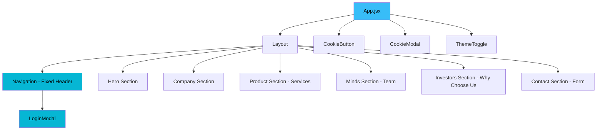
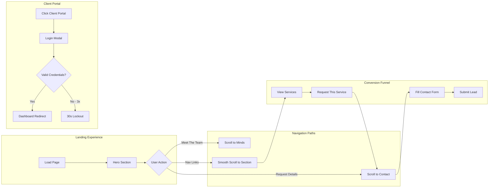
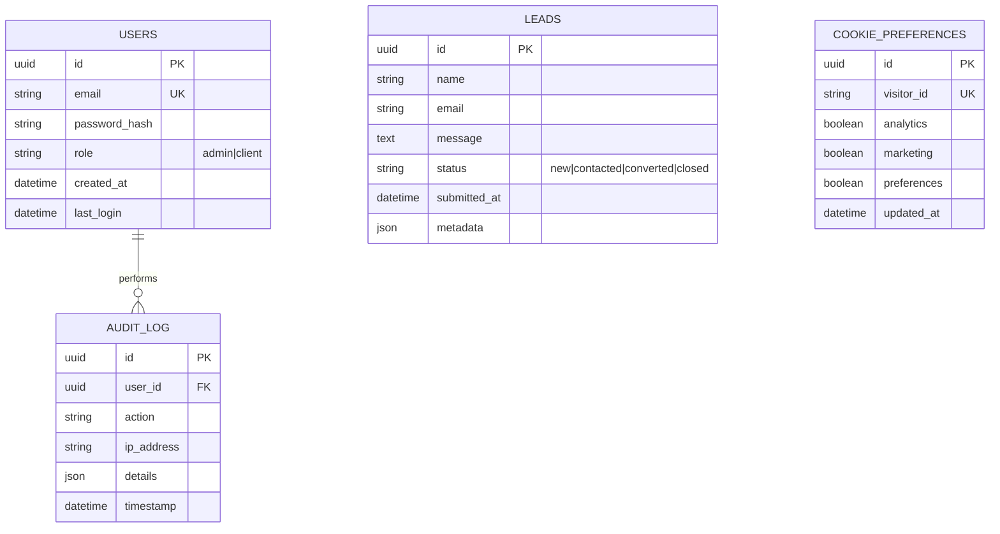
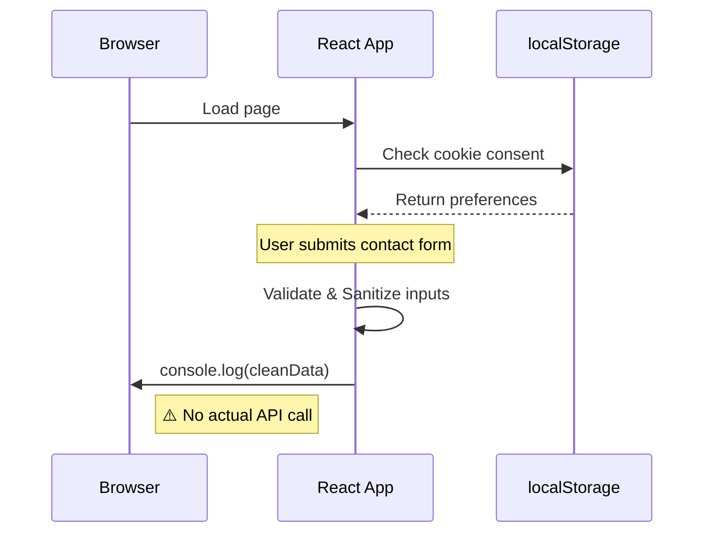
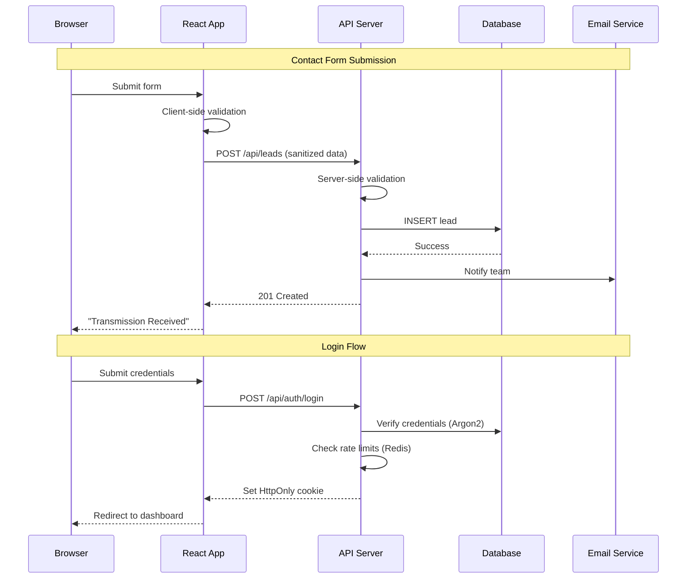
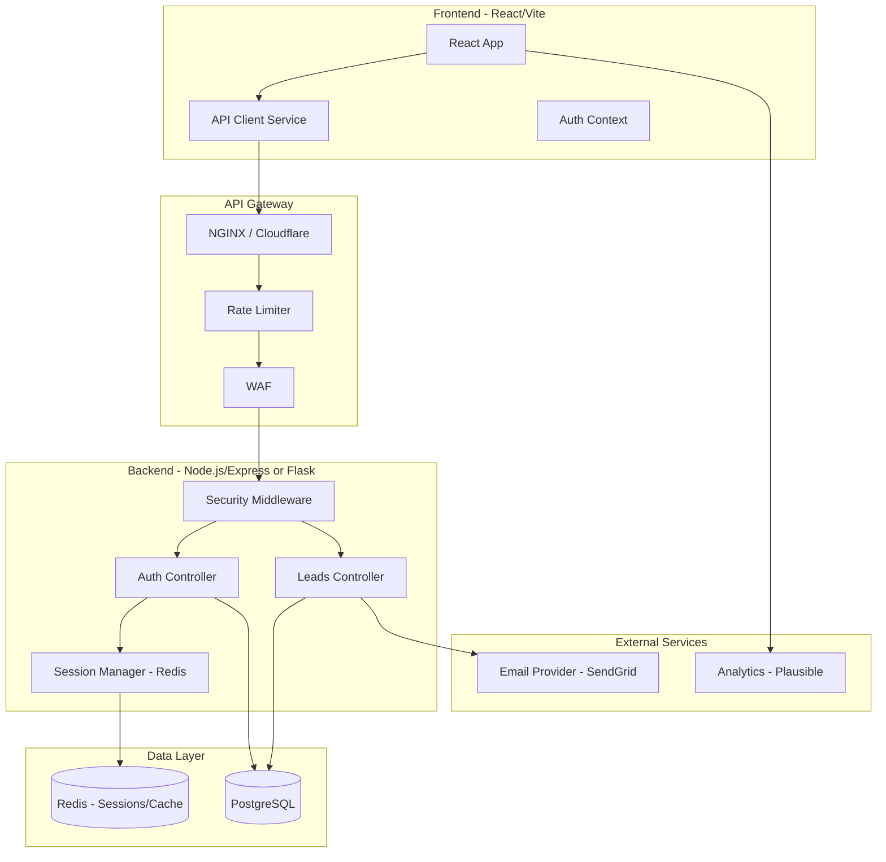

# SecurePent Website - Complete Architecture Analysis

A comprehensive analysis of the website structure, user flow, database design considerations, communication patterns, and integration architecture.

---

## 1. Website Overview

**SecurePent** is a single-page React 19 landing page for an offensive security company specializing in **WordPress pentesting services**. The site uses **Vite** as its build tool and features a premium dark theme with glassmorphic design elements.

### Tech Stack
| Layer | Technology |
|-------|------------|
| Framework | React 19.2 |
| Build Tool | Vite 7.3 |
| Styling | Pure CSS3 (Variables, Flexbox, Grid) |
| Security | DOMPurify for XSS protection |
| State | React useState/useEffect (local) |

---

## 2. Website Structure

### Component Hierarchy

| Component | Purpose | Key Features |
|-----------|---------|--------------|
| App.jsx | Root component | State management for cookie modal |
| Navigation.jsx | Fixed header | Smooth scroll, Client Portal login |
| Hero.jsx | Landing area | Animated mesh, CTAs |
| CompanySection.jsx | About us | Stats (24/7, 100+ zero-days) |
| ProductSection.jsx | Services | Tier 1 & Tier 2 pricing cards |
| MindsSection.jsx | Team | Grayscale-to-color hover effect |
| InvestorsSection.jsx | Why Choose Us | Trust signals (ethics, OWASP, PoC) |
| ContactSection.jsx | Lead capture | Secure form with validation |
| LoginModal.jsx | Client portal | Brute force protection |
| CookieModal.jsx | GDPR compliance | Toggle preferences |

---

## 3. User Flow

### Primary User Journeys

1. **New Visitor → Lead Conversion**
   - Land on Hero → Read Company story → View Service tiers → Contact form submission

2. **Existing Client → Portal Access**
   - Nav → Client Portal → Login Modal → Dashboard (future)

3. **Cookie Consent Flow**
   - After 1.5s delay → Cookie button appears → User manages preferences

---

## 4. Current Database Needs (Frontend Only)

> [!IMPORTANT]
> **No backend or database exists currently.** The site is purely frontend.

### Proposed Database Schema

When a backend is implemented, the following entities would be needed:

### Data Currently Stored (Client-Side)

| Data | Storage | Key |
|------|---------|-----|
| Cookie preferences | `localStorage` | `cookiePreferences` |
| Cookie consent flag | `localStorage` | `cookieConsent` |
| Login attempts | React state | In-memory only |

---

## 5. Communication Patterns

### Current State (No Backend)

### Proposed Backend Integration

---

## 6. Security Architecture

### Implemented (Frontend)

| Protection | Location | Details |
|------------|----------|---------|
| **XSS Prevention** | src/utils/security.js | DOMPurify sanitization |
| **SQL Injection Detection** | src/utils/security.js | Regex pattern matching |
| **Command Injection Detection** | src/utils/security.js | Blocks `|`, `&`, `;`, etc. |
| **Brute Force Protection** | src/components/LoginModal.jsx | 3 attempts → 30s lockout |
| **Content Security Policy** | index.html | `default-src 'self'` |

### Required for Backend (See SECURITY.md)

- Argon2/Bcrypt password hashing
- HttpOnly, Secure, SameSite cookies
- CSRF tokens for state-changing requests
- HTTPS with TLS 1.3
- Redis-based rate limiting
- WAF (Cloudflare/AWS)

---

## 7. Integration Architecture

### Full-Stack Integration Plan

### API Endpoints Needed

| Endpoint | Method | Purpose |
|----------|--------|---------|
| `/api/leads` | POST | Submit contact form |
| `/api/auth/login` | POST | Client portal login |
| `/api/auth/logout` | POST | Destroy session |
| `/api/auth/session` | GET | Verify session |
| `/api/cookies/preferences` | POST | Store server-side consent |

---

## 8. Key Files Summary

| File | Lines | Purpose |
|------|-------|---------|
| src/App.jsx | 51 | Root with section layout |
| src/components/Navigation.jsx | 175 | Fixed nav with scroll |
| src/components/ContactSection.jsx | 286 | Lead capture form |
| src/components/LoginModal.jsx | 289 | Auth simulation |
| src/components/ProductSection.jsx | 258 | Service tier cards |
| src/utils/security.js | 66 | Sanitization utilities |

---

## 9. Current Limitations

> [!WARNING]
> The website is **frontend-only**. Several features are simulated.

| Feature | Current State | Needed |
|---------|---------------|--------|
| Contact form | Logs to console | POST to API |
| Login | Hardcoded demo user | Real auth system |
| Cookie consent | localStorage only | Server-side tracking |
| Rate limiting | In-memory state | Redis-backed |

---

## Conclusion

SecurePent is a well-structured, security-conscious frontend landing page ready for backend integration. The component architecture is modular, the styling is consistent through CSS variables, and client-side security measures (DOMPurify, pattern validation, brute force simulation) demonstrate **security by design principles**.

**Next steps for full integration:**
1. Create Node.js/Express or Flask API server
2. Set up PostgreSQL + Redis
3. Implement JWT or session-based auth
4. Connect Contact form to `/api/leads`
5. Add email notifications for new leads
6. Replace `localStorage` cookie consent with server-side tracking
